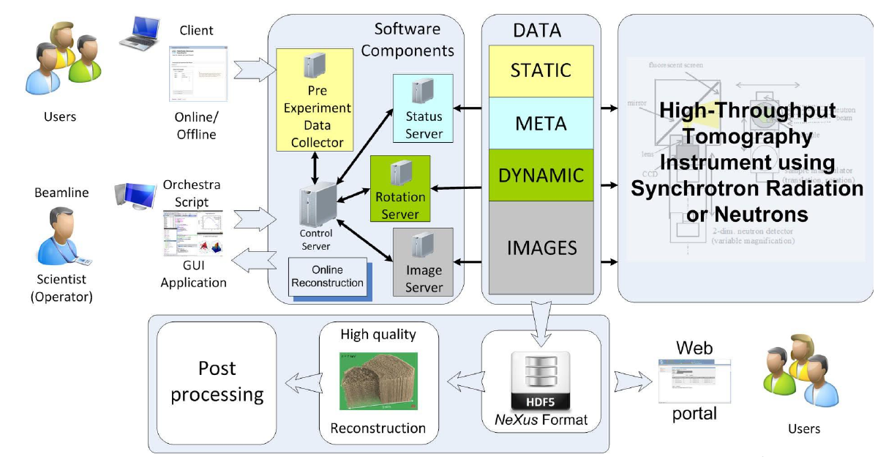

# X-Environment

X-Environment (X = Integrated Control System)

## Servers

| Name | Platform | Repository | Download |
|----------|-------|-----|-----------|
| PreExperimentDataCollector   | Tango/Java 11+ | [GitHub](https://github.com/hzg-wpi/pre-experiment-data-collector) | |
| StatusServer   | Tango/Java 11+ | [GitHub](https://github.com/hzg-wpi/status-server) | |
| DataFormatServer   | Tango/Java 11+ | [GitHub](https://github.com/hzg-wpi/data-format-server) | |
| CamelIntegration   | Tango/Java 11+ | [GitHub](https://github.com/hzg-wpi/camel-integration) | |
| HeadQuarter   | Tango/Java 11+ | [GitHub](https://github.com/hzg-wpi/xenv-hq) | |

## Clients

| Name | Platform | Repository | Download |
|----------|-------|-----|-----------|
| IDL2Tango   | IDL/Java 11+ | [GitHub](https://github.com/hzg-wpi/idl2tango) | |

## GUIs

| Name | Platform | Repository |
|----------|-------|-----------|
| XenvHQ   | Waltz | [GitHub](https://github.com/hereon-wpi/xenvhq-waltz-plugin) |
| TangoRestServer   | Servlet 4.1/Java 11+ | [GitHub](https://github.com/hereon-wpi/rest-server) |

## Libraries

| Name | Platform | Repository |
|----------|-------|-----------|
| JTango   | Java 11+ | [GitHub](https://github.com/hereon-wpi/jtango) |
| libpniio-jni   | Java 11+/Debian 10 x86_64 | [GitHub](https://github.com/hereon-wpi/libpniio-jni) |

## Publications

[1] I.Khokhriakov, et al., A Platform for Tango Controls Web Applications, Proceedings of ICALEPCS2019, WESH3003, 2019 [link](https://accelconf.web.cern.ch/icalepcs2019/doi/JACoW-ICALEPCS2019-WESH3003.html)

[2] I.Khokhriakov, et al., Integrated control system environment for high-throughput tomography, SPIE Proc. 2017 [link](https://www.spiedigitallibrary.org/conference-proceedings-of-spie/10391/103911H/Integrated-control-system-environment-for-high-throughput-tomography/10.1117/12.2275863.short)

[3] I.Khokhriakov, et al., Integrated control system environment for high-throughput tomography, SPIE Proc. 2014 [link](http://spie.org/Publications/Proceedings/Paper/10.1117/12.2060975)
